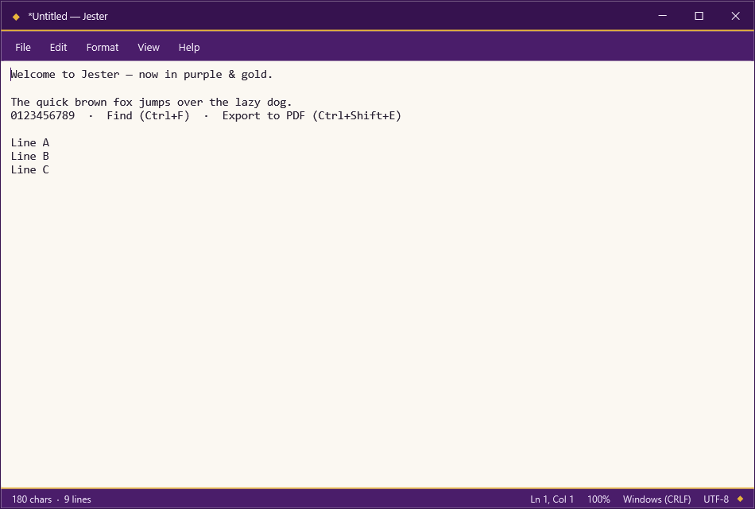

<div align="center">


# Jester

**A lightweight, beautiful notepad for Windows — purple & gold.**

[](https://github.com/dominikkoenitzer/Jester/actions/workflows/ci.yml)
[](../../releases/latest)
[](LICENSE)


[**⬇ Download**](#-download) · [Features](#-features) · [Shortcuts](#-keyboard-shortcuts) · [Build](#-build-from-source) · [Contributing](#-contributing)



</div>

## ⬇ Download

1. Head to the [**latest release**](../../releases/latest).
2. Download **`Jester-<version>-win-x64.exe`**.
3. Double-click to run. That's it.

It's a single, **portable** file — no installer, and **no .NET install required** (the runtime is bundled). Works on **Windows 10 and 11 (64-bit)**.

> First launch may show a SmartScreen prompt because the build is unsigned — choose *More info → Run anyway*.

## ✨ Features

- **Files** — New, Open, Save, Save As, drag-and-drop, and "Open with Jester" from Explorer.
- **Export to PDF** — turn any note into a clean, paginated A4 PDF (`Ctrl+Shift+E`).
- **Find & Replace** — find, replace, replace all, match case, wrap-around, and direction.
- **Go To Line**, **insert time/date**, unlimited **undo/redo**.
- **Format** — word wrap and a font picker (family, size, bold, italic).
- **View** — zoom (menu or `Ctrl` + mouse wheel) and a toggleable status bar.
- **Status bar** — characters, lines, caret position, zoom, line ending, and encoding.
- **Safe by default** — prompts before discarding unsaved work (including on sign-out/shutdown) and saves atomically so a crash can't corrupt your file.
- **Encoding aware** — detects UTF-8/UTF-16 BOMs and preserves the file's original encoding and line endings.

## ⌨ Keyboard shortcuts

| Action | Shortcut | Action | Shortcut |
| --- | --- | --- | --- |
| New | `Ctrl+N` | Find | `Ctrl+F` |
| Open | `Ctrl+O` | Find Next / Previous | `F3` / `Shift+F3` |
| Save | `Ctrl+S` | Replace | `Ctrl+H` |
| Save As | `Ctrl+Shift+S` | Go To Line | `Ctrl+G` |
| Export to PDF | `Ctrl+Shift+E` | Time/Date | `F5` |
| Exit | `Ctrl+W` | Zoom In / Out | `Ctrl++` / `Ctrl+-` |
| Undo / Redo | `Ctrl+Z` / `Ctrl+Y` | Restore Zoom | `Ctrl+0` |
| Select All | `Ctrl+A` | | |

## 🛠 Build from source

**Prerequisites:** [.NET 9 SDK](https://dotnet.microsoft.com/download) on Windows.

```sh
git clone https://github.com/dominikkoenitzer/Jester.git
cd Jester
dotnet run -c Release
```

Produce the portable single-file build that ships in releases:

```sh
dotnet publish Jester.csproj -c Release -r win-x64 --self-contained true ^
  -p:PublishSingleFile=true -p:IncludeNativeLibrariesForSelfExtract=true ^
  -p:EnableCompressionInSingleFile=true
```

The executable lands in `bin/Release/net9.0-windows/win-x64/publish/Jester.exe`.

## 🧱 Project structure

| Path | Purpose |
| --- | --- |
| `App.xaml(.cs)` | Application entry point; opens a command-line file if given. |
| `MainWindow.xaml(.cs)` | Main window: menus, editor, status bar, and command logic. |
| `ThemedWindow.cs` | Base window with the custom title bar / chrome. |
| `Theme.xaml` | The purple & gold theme — palette and control styles. |
| `JesterCommands.cs` | Custom routed commands and key gestures. |
| `PdfExporter.cs` | Renders the document to PDF (QuestPDF). |
| `FindReplaceWindow`, `GoToWindow`, `FontWindow` | Dialogs. |
| `Assets/jester.ico` | Application icon. |

## 🤝 Contributing

Contributions are welcome! Please read [CONTRIBUTING.md](CONTRIBUTING.md). Found a bug or have an idea? [Open an issue](../../issues/new/choose).

## 📄 License

Jester is free software licensed under the **[GNU GPL v3.0](LICENSE)**.
Copyright © 2026 Dominik Könitzer.

<div align="center"><sub>Built with C# and WPF on .NET 9.</sub></div>
